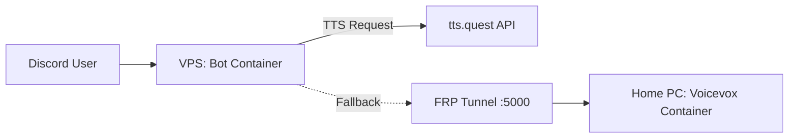

# QuoteSpeaker Bot 🗣️

Voicevoxを使用したDiscord読み上げBotです。画像OCR機能、辞書機能、自動読み上げ機能を搭載しています。
VPS（Bot本体）と自宅PC（VOICEVOXエンジン）を連携させるハイブリッド構成で動作します。

## 機能 🚀

- **読み上げ機能 (TTS)**
  - Voicevox (Zundamon / Speaker ID: 3) を使用。
  - テキストチャットの内容をボイスチャットで読み上げ。
  - `/autoread` で読み上げのON/OFF切り替え。
  - 外部API (`tts.quest`) を優先利用し、リソースがない場合やAPI制限時に自宅PCのエンジンへフォールバック。

- **画像読み上げ (OCR)**
  - 画像が添付された場合、Google Vision APIで文字を認識して読み上げ。
  - **Quote画像対応**: Make it a Quoteなどで作成された画像を自動判別し、ヘッダー・フッター・IDなどのノイズを除去して本文のみ読み上げ。
  - **テキストOCR**: リプライやVC外でのメンション時は、読み上げずにテキストでOCR結果を返信。

- **便利機能**
  - `/dict`: 読み間違いを修正する辞書登録機能（追加/削除/一覧）。
  - `/ping`: Botの応答速度確認。
  - `s` コマンド: 現在の読み上げをスキップ。
  - `ss` コマンド: 読み上げキューを全削除して停止。
  - 入退室通知: Auto-read有効時、メンバーの入退室を読み上げ。

## システム構成 🏗️

このBotは以下の2つの環境に分散配置することを想定しています。

1. **VPS (Bot本体)**: Discord Botが動作。FRPクライアントからの接続を受け付ける（またはVPN/Tunnel経由で自宅PCへ接続）。
2. **自宅PC (VOICEVOX)**: 高負荷な音声合成エンジンをDockerで実行。FRP等を用いてポートをVPSへ公開。



## セットアップ手順 🛠️

### 前提条件
- Docker & Docker Compose
- Discord Bot Token
- Google Cloud Vision API Key
- FRP (Fast Reverse Proxy) または類似のトンネリング環境

### 1. VPS側 (`/dist_vps`)

1. `dist_vps` フォルダをVPSに配置します。
2. `.env` ファイルを作成・編集します。
   ```bash
   DISCORD_TOKEN=your_token_here
   GOOGLE_VISION_API_KEY=your_key_here
   VOICEVOX_API_KEY=your_voicevox_api_key_here
   # VOICEVOX_URL=http://host.docker.internal:5000 (デフォルト)
   ```
3. 起動します。
   ```bash
   docker-compose up -d --build
   ```

### 2. 自宅PC側 (`/dist_home`)

1. `dist_home` フォルダを自宅PCに配置します。
2. VOICEVOXエンジンを起動します。
   ```bash
   docker-compose up -d
   ```
3. `frpc.toml` を編集して、VPSのFRPサーバーへ接続設定を行います。
   - ローカルポート: `50021`
   - リモートポート: `5000` (VPS側から見えるポート)
4. FRPクライアントを起動してトンネルを確立します。

## コマンド一覧 📜

| コマンド | 説明 |
| --- | --- |
| `/join` | ボイスチャンネルに参加 |
| `/leave` | ボイスチャンネルから退出 |
| `/autoread` | 自動読み上げモードの切り替え (ON/OFF) |
| `/speak [text] [image]` | 指定したテキストまたは画像を読み上げ |
| `/dict add [word] [reading]` | 辞書に単語を登録 |
| `/dict remove [word]` | 辞書から単語を削除 |
| `/dict list` | 辞書一覧を表示 |
| `/ping` | レイテンシを表示 |
| `s` | (チャット) 現在の読み上げをスキップ |
| `ss` | (チャット) 全ての読み上げを停止 |

## ディレクトリ構造

- `dist_vps/`: VPSデプロイ用ファイル一式
- `dist_home/`: 自宅PCデプロイ用ファイル一式
- `index.js`: (開発用) オリジナルソースコード
